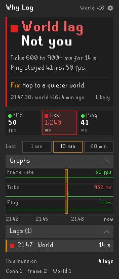
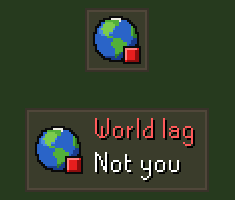

- Know in one glance whether the lag is your PC, your connection or the world. 
- And the one thing to do about it.

<table width="100%">
<tr>
<td valign="top">

## What it shows

- **The answer.** Two big lines at the top: what caused the lag and whose side it is on, in plain words, with the one fix under it.
- **Three cells.** Frames per second, server tick time and ping to the game server, each green, amber or red.
- **Graphs.** The last 1, 10 or 60 minutes on one time line, every lag marked.
- **Lags.** Open the Lags row for every lag in that range, newest first, with its time, cause and length. The session's count sits under it.

## Quick guide

1. **Install and play.** It starts when you log in. Nothing to set up.
2. **Lag?** Look at the badge on the game screen, or open the sidebar: the answer is at the top, the fix under it.
3. **Range.** 1 min, 10 min or 60 min, above the graphs.
4. **Settings.** The gear at the top right: the badge's style, whether it shows while smooth, and a chat line on each lag.
5. **Found a bug?** Open the gear, choose Troubleshoot..., press Copy report and paste it into your post.

## Good to know

- **How it decides.** Frames, server ticks and ping are read together, because a late tick can come from the world, your connection or your PC.
- **Ping** is measured on the game's own connection, not a separate test.
- **Privacy.** The plugin sends nothing at all, ever.

</td>
<td width="28"></td>
<td align="right" valign="top" width="235">

 

</td>
</tr>
</table>

 

<table width="100%">
<tr><td colspan="3"></td></tr>
<tr>
<td valign="top">

## The game badge

- **Four styles.** Icon, icon and words, shape and words, or a shape alone.
- **On a lag** the icon names the cause and the shape turns amber or red; smooth is a green circle, or nothing if you prefer.
- **Hover** for the numbers. Move the icon styles like any infobox, and the styles with words with Alt + drag.

</td>
<td width="28"></td>
<td align="right" valign="top" width="235">

 

</td>
</tr>
</table>

---

<strong>Found a bug or have an idea?</strong> Join the <a href="https://discord.gg/nsam4CfWzf">2hBuilds Discord</a>.

Want every figure and setting explained? Read the <a href="https://github.com/2hBuilds/why-lag/blob/main/DETAILS.md">full details</a>.
